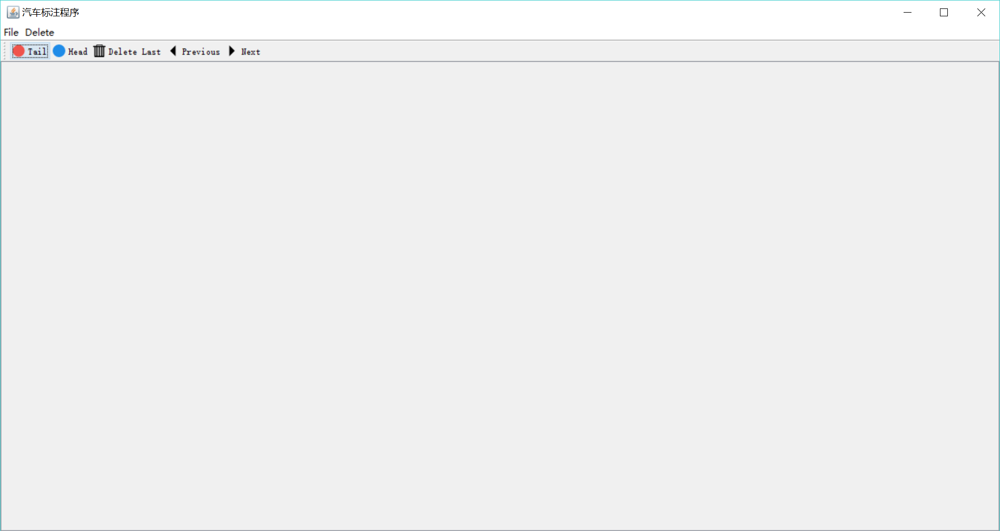
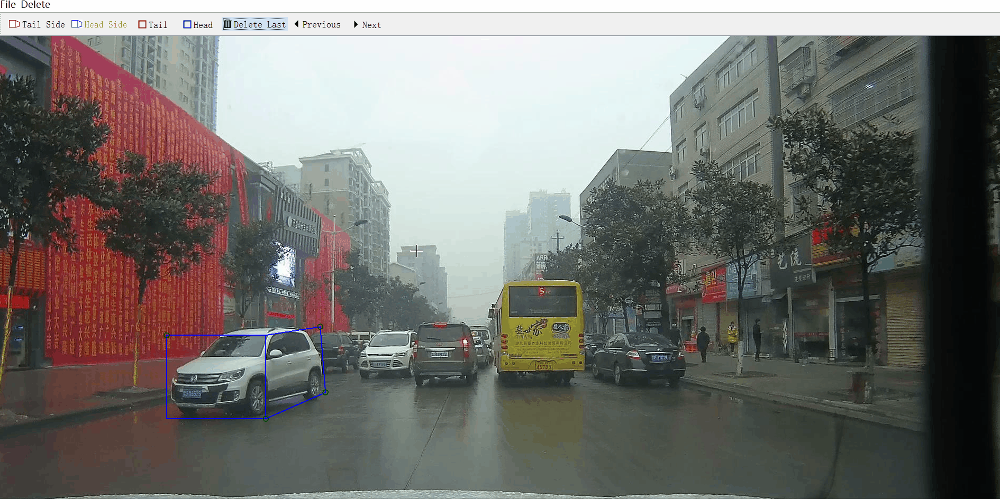
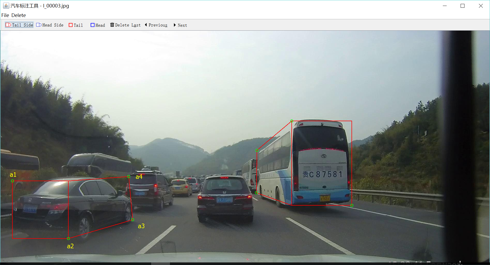

# 汽车标注工具文档1.0

## 概述

本工具使用Java语言开发，只能运行在64位Windows系统，主要实现了标注汽车正面，背面和侧面的功能，并把标注的坐标保存在txt文件中。

## 操作方法

### 主界面

### 打开
在菜单栏选择File -> Open

### 工具栏
- Tail Side 表示用红色标注车尾和侧面；
- Head Side 表示用蓝色标注车头和侧面；
- Tail 用红色标注车尾；
- Head 用蓝色标注车头。
- Delete Last 删除上一个标注
- Previouse 保存本张图片的标注，加载上一张图片
- Next 保存本张图片的标注并加载下一张图片
### 标注汽车
- Tail Side

- Head Side

- Tail

- Head

### 鼠标
#### 左键
用来画图，其中标注车头、车尾用拖拽方法（在左上角按下鼠标拖拽到右下角），车侧身两个点用点击确定。
#### 右键
右键选中坐标点可以微调该点
## 标注文件格式

标注文件：

|part|a1.x|a1.y|a2.x|a2.y|a3.x|a3.y|a4.x|a4.y|
> tail 46 584 268 810 512 735 497 567

注意：当只标注head或tail时，a3,a4,的坐标会设置为0

